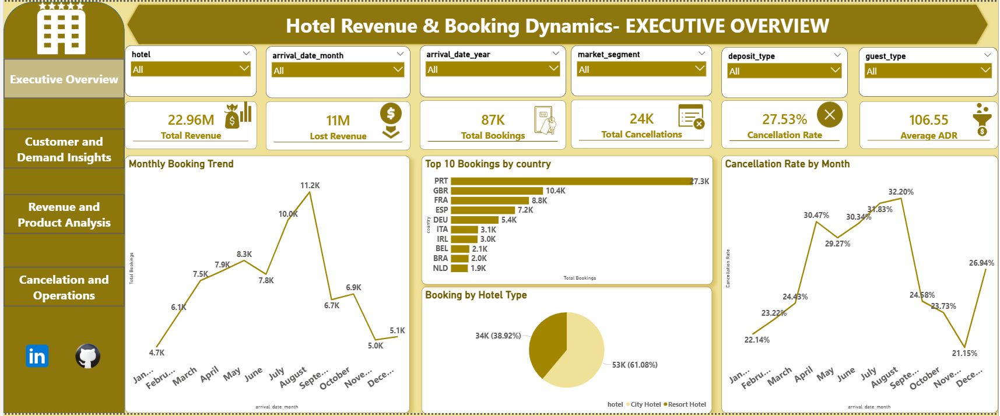
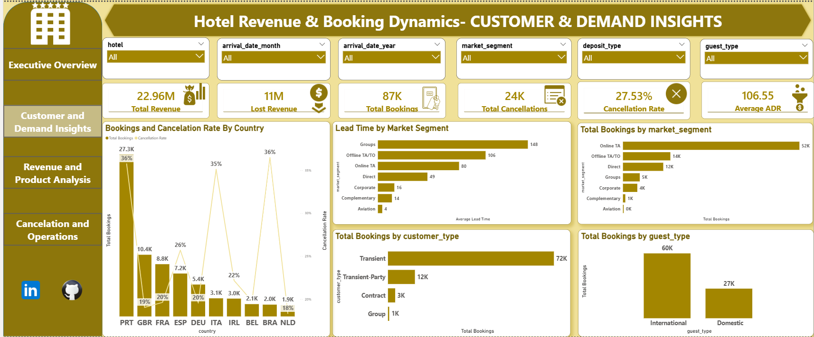
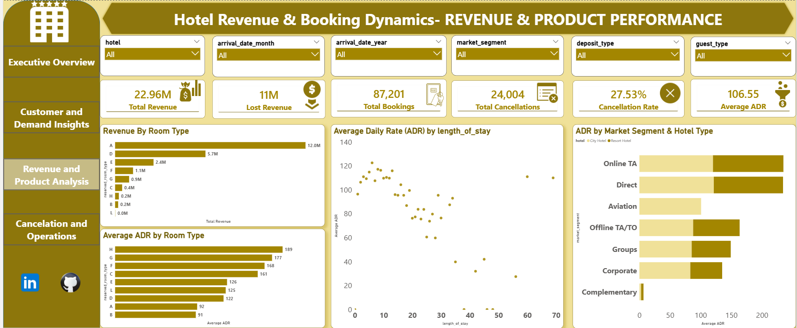
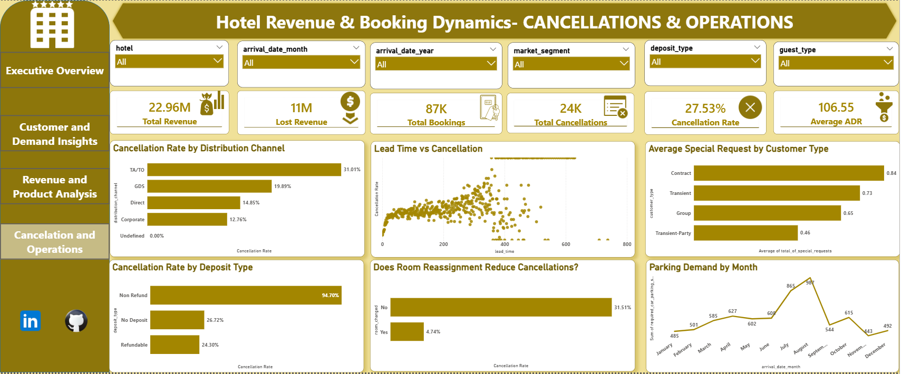

# Hotel Revenue & Booking Dynamics: End-to-End SQL & Power BI Analysis
---

## Project Overview

- **Objective**: To identify key drivers of hotel cancellations and revenue leakage.

- **The Problem**: The hotel was experiencing a 28% cancellation rate, resulting in $11M of potential lost revenue.

- **The Goal**: offer some actionable recommendations to help management:
  
1.know Geographic Impact on Demand and Cancellations
  
2.understand Customer Distribution by Market Segment & Lead Time

3.understand Product Performance: Room Types vs. Revenue

4.determine if Room Reassignments affects the guests.

5.Understand the peak of bookings.

6.Understand The demographics of the customers.

7.know which distribution channels, yield the lowest cancellation rates, and the average wait list time for these channels.

8.understand the trend of domestic and international guests.

## Tools used

- Database: MySQL (Data Cleaning, Feature Engineering)

- Visualization: Power BI (Interactive Dashboards, DAX)

## Data Pipeline & Cleaning (The “How”)

To ensure analytical accuracy and dashboard reliability, the dataset was processed through a **structured MySQL pipeline**. A raw backup table was maintained to preserve source data integrity.

## Data Scrubbing

The process focused on improving quality across 119K+ records. Missing values in fields like agent and company were standardized. Invalid “Ghost Bookings” (zero guests) were removed to prevent artificial demand inflation. Finally, a deduplicated analytical table was generated to serve as the "Single Source of Truth" for Power BI KPIs.

## Feature Engineering

Strategic columns were engineered in MySQL to drive deeper insights:

- **revenue**: (ADR × Length of Stay) for successful check-ins.

- **room_changed**: Tracks Reserved vs. Assigned room types to measure the "Upgrade Effect" on churn.

- **guest_type**: Segmented into Domestic (PRT) and International to identify geographic risk.

- **booking_id**: Added as a Primary Key to ensure model integrity and row-level traceability.

## Executive Overview

- The hotel successfully generated $22.96M in revenue from 87K bookings. However, it faces a massive efficiency gap, with 24K cancellations (a 28% rate) leading to $11M in lost revenue.

- The hotel maintains a healthy Average Daily Rate (ADR) of $106.55, which serves as the baseline for all pricing optimizations.

## Key Business Insights

 

### Geographic Risk & Opportunity

- Portugal is the primary market by volume (27.3K bookings), but it is also the highest risk, with a 35.75% cancellation rate.

- The United Kingdom represents the most "reliable" demand, combining high volume with one of the lowest cancellation rates at 19.05%.

- International guests (60K) drive the peak summer revenue, while domestic guests (27K) provide the foundational volume needed to sustain the hotel during off-peak periods.

### Lead Time & Channel Dynamics

-  Higher lead times—particularly in the "Groups" segment (148 days average)—correlate with higher cancellation rates. The longer a booking sits on the books, the more likely it is to be lost.

- Direct Bookings are the most efficient, yielding the lowest cancellation rate (14.9%) and the fastest processing time (0.3 days average waitlist).

- Travel Agent (TA/TO) channels have the highest churn (31%) and a significantly slower waitlist time (1.2 days), indicating a lag in communication or booking confirmation.

### Customer Demographics

- The business is heavily reliant on Transient guests (72K bookings), who are typically short-stay or independent travelers, rather than contract or group-based business.

### Operations & Seasonality

- Demand peaks sharply in August with 11.2K bookings, placing maximum strain on resources like parking (which peaks at 987 spaces).

- There is a significant 50% drop in capacity utilization during November and December, identifying a critical need for off-season revenue strategies.

### Guest Behavior & Product Performance

-  A critical discovery in the data shows that room reassignments (moving a guest from their reserved type to a different assigned type) drastically improve retention. Guests with room changes had only a 4.7% cancellation rate, compared to 31.5% for those with no change.

-  Room Type A is the primary revenue driver ($12M total revenue), but it operates at a lower ADR ($92). In contrast, Premium Rooms (H and G) have high ADRs (up to $189) but suffer from low utilization.

## Recommendations

1. **Geographic & Market Strategy**
   
- Geographic De-Risking: Implement a "Tiered Deposit" policy specifically for high-volume, high-churn regions like Portugal (35.8% cancellation rate). Requiring non-refundable deposits in these areas will secure revenue while allowing you to maintain flexible policies for stable markets like the UK.

- Guest Trend Management: Balance the 60K International majority with a robust Domestic loyalty program. Since international travel is seasonal, domestic guests (27K) should be targeted with specialized winter offers to ensure consistent occupancy year-round.

2. **Booking & Cancellation Management**
   
- Lead-Time Safeguards: For the "Groups" segment and bookings with lead times exceeding 100 days, deploy an automated 30-60-90 day reconfirmation sequence. Identifying intent to cancel early allows the hotel to release and resell those rooms.

- Channel Efficiency Optimization: Reallocate marketing and commission budgets away from high-waitlist TA/TO channels (which have a(0.8597) lag) and into "Direct Booking" incentives. Offering perks like free parking or breakfast for direct bookings can help lower the cancellation rate to the 14.9% seen in direct channels.

3. **Revenue & Product Optimization**
- Inventory Optimization: Launch "Pre-Arrival Upsell" campaigns.the data shows Room Type A is over-capacity but low-margin ($92 ADR); moving these guests into under-utilized Premium rooms (Types H,G,F,C) (with the ADR of 189,177,168,161 respectively) maximizes total ADR and clears space for last-minute budget bookings.

- Institutionalize Proactive Upgrades:the Data proves that room reassignments trigger guest commitment, reducing cancellation probability by 85%. Use your MySQL flags to identify high-risk profiles and offer proactive upgrades to "lock in" the stay.

4. **Operational & Demographic Targeting**
   
- Seasonal Operations Scaling: Management should scale staffing and parking infrastructure specifically for the August peak (11.2K bookings). Conversely, pivot to "Domestic Staycation" packages in November and December to mitigate the 50% winter slump.

- Segment-Specific Marketing: Tailor digital marketing to the "Transient" demographic (72K bookings). This group values flexibility and speed; ensure the mobile booking experience is streamlined and emphasize "flexible cancellation" for a small premium to capture this independent traveler segment.

### 📊 Project Deliverables
- **Interactive Dashboard:** [View Power BI File & Presentation on Google Drive]((https://drive.google.com/drive/folders/1lhtg-hgr4-6WLJfxzbFDDPcBnIWA2UxP?usp=sharing))
